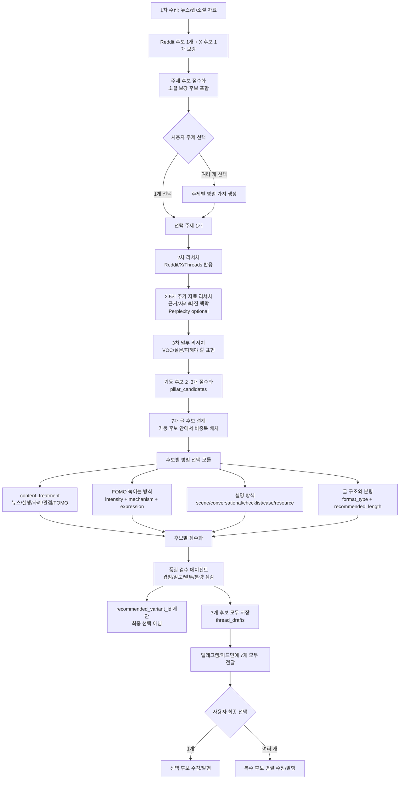

# Logic Circuit

최종 선택은 생성기 내부에서 선행하지 않는다. 생성기는 점수와 추천을 만들고, 사용자가 7개 후보를 본 뒤 선택한다.

## Activation Rules

| 신호 | 켜지는 스위치 | 결과 |
|---|---|---|
| 주제 후보를 여러 개 선택함 | topic branch | 각 주제별로 별도 7개 후보 묶음을 생성 |
| 1차 후보가 뉴스에 쏠림 | social supplement | Reddit 후보 1개와 X 후보 1개를 추가 제안 |
| 주제 1개가 확정됨 | `pillar_candidates` | 기둥 2~3개를 점수화하고 설계 범위를 잡음 |
| 사용자가 주제를 확정함 | research layers | 2차 SNS 반응, 2.5차 근거, 3차 말투 리서치를 순서대로 실행 |
| 기사/이슈는 있는데 실전 팁 근거가 약함 | `content_treatment=news_commentary` | 억지 팁 없이 코멘터리/관점형으로 처리 |
| 놓치면 손해, 나중 후회, 룰 변화, 격차가 보임 | `fomo_intensity`, `fomo_mechanism`, `fomo_expression` | FOMO를 yes/no가 아니라 강도와 위치로 녹임 |
| 독자가 모를 새 개념, 기술명, 행사명, 약어가 있음 | `explanation_style=conversational_explainer` | 문답지가 아니라 자연스러운 설명문으로 쉽게 풂 |
| 한 포스트 안에 장면/맥락/관점/마무리가 충분함 | `format_type=single_post` | 최소 500자 이상으로 단일글 작성 |
| 포스트별 역할이 분리됨 | `format_type=short_thread` | 각 포스트가 다른 역할을 가짐 |
| 예시/검색어/문장/도구가 5개 이상 있음 | `format_type=resource_thread` | 저장형 자료 스레드로 확장 |
| 7개 후보 생성 완료 | quality review | 부족한 후보를 저장 전 보강하고 검수 기록을 남김 |
