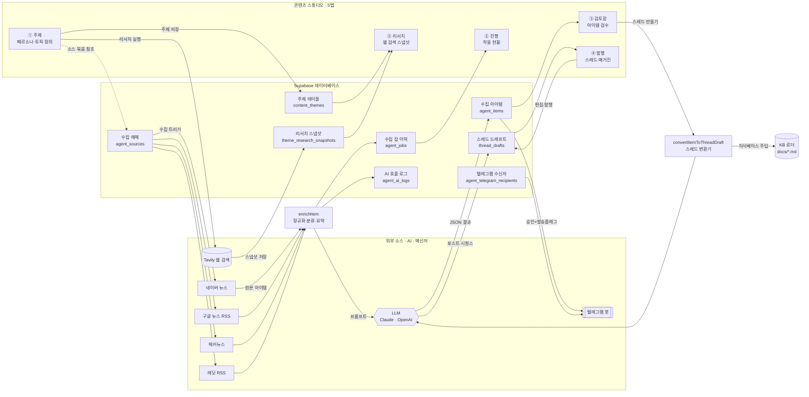
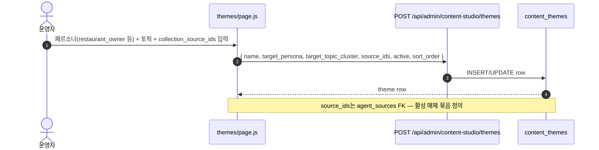
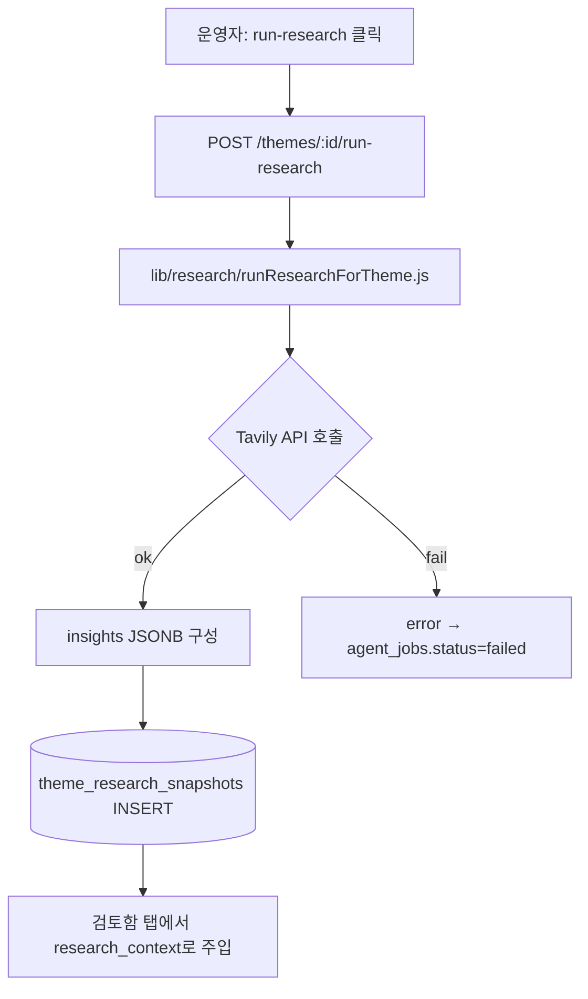
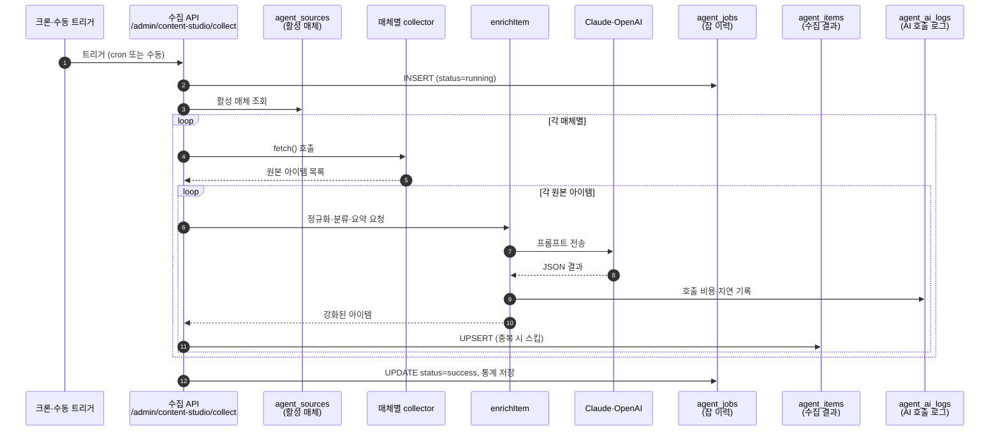
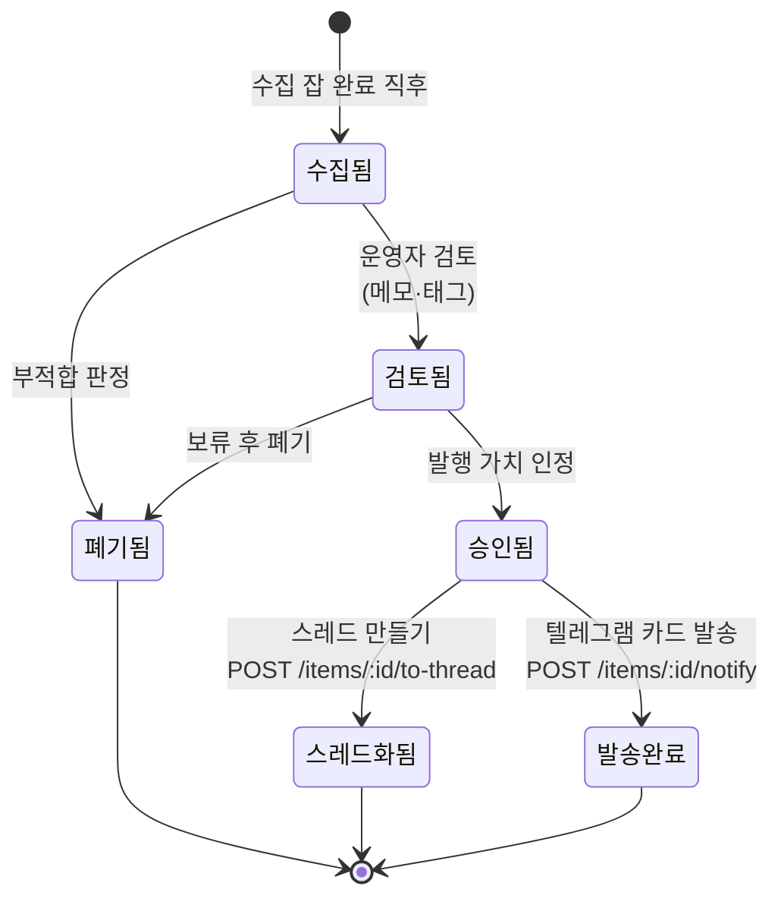
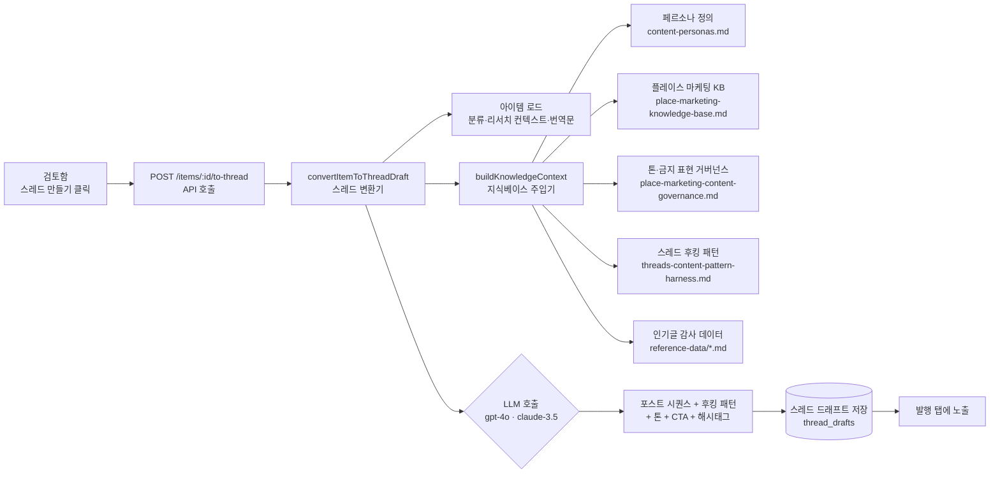
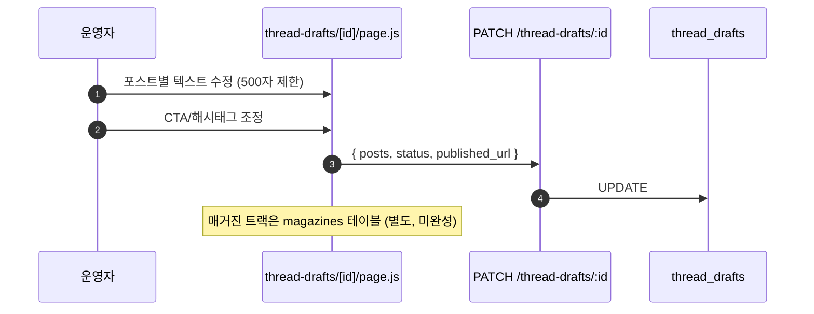
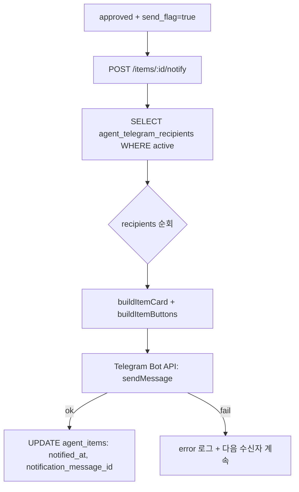

# 콘텐츠 스튜디오 파이프라인 명세서

> **작성일**: 2026-05-20
> **범위**: `app/admin/content-studio` 전 영역 — 주제 → 리서치 → 검토 → 발행(스레드/매거진) → 진행
> **목표**: 각 단계의 데이터 흐름, 의존성, 영향 관계를 도식화하여 "한 곳을 바꾸면 어디가 흔들리는지" 한 장에서 보이게 한다.

---

## 0. 한눈에 보는 파이프라인 (전체 다이어그램)



> **읽는 법**: 실선은 데이터/명령 흐름, 점선은 참조. LLM 박스는 모든 AI 호출이 거치는 공통 게이트.

---

## 1. 5탭 IA와 각 단계 책임

| #  | 탭        | 라우트                                 | 한 줄 책임                        | 핵심 산출 테이블                  |
|----|-----------|----------------------------------------|-----------------------------------|----------------------------------|
| 1  | 주제      | `/admin/content-studio/themes`         | 페르소나·토픽 정의, 수집 소스 묶기 | `content_themes`                 |
| 2  | 리서치    | `/admin/content-studio/research`       | Tavily 웹 검색 스냅샷             | `theme_research_snapshots`       |
| 3  | 검토함    | `/admin/content-studio/` (기본)        | 수집된 아이템 검수·상태 변경       | `agent_items` (status, send_flag)|
| 4  | 발행      | `/admin/content-studio/published`      | 스레드/매거진 드래프트 편집·발행   | `thread_drafts`, `magazines`     |
| 5  | 진행      | `/admin/content-studio/activity`       | 자동화 작동 현황 + 에러 요약       | `agent_jobs`, `agent_ai_logs`    |

---

## 2. 단계별 세부 흐름

### 2.1 주제 정의 (Themes)



**영향 관계**
- `target_persona` 변경 → 이후 모든 `enrichItem` / `convertItemToThreadDraft` 의 KB 주입 컨텍스트가 달라짐 ([[project_data_model]] 참조).
- `collection_source_ids` 변경 → 다음 `collect` 잡이 가져오는 매체 집합이 즉시 바뀜 (DB는 단일 SSOT).
- `active=false` 토글 → 리서치/수집 잡 양쪽에서 자동 스킵.

### 2.2 자동 리서치 (Research)



**영향 관계**
- 같은 theme에 누적 스냅샷이 쌓임. 검토 단계가 **항상 최신 스냅샷**을 참조하므로, 오래된 스냅샷이 남아있어도 안전.
- Tavily 키 누락 시 리서치 단계만 실패하고 수집·검토는 정상 동작 (graceful degradation).

### 2.3 수집 (Collect) — 검토함 진입 직전



**영향 관계**
- `agent_items` UNIQUE(source, post_id) — 동일 글 재수집 시 INSERT 실패 → silently skip. 중복 폭주 방지.
- `enrichItem`의 모델 변경 → `agent_ai_logs.cost_usd` 트렌드가 즉시 변함 → 진행 탭 비용 카드에 반영.
- 한 매체 collector 예외 발생 시 다른 매체는 계속 실행 (try/catch per-source).

### 2.4 검토함 (Review) — 사람 손이 들어가는 게이트



**영향 관계**
- `status='approved'` 전이 시 `send_flag=true` 자동 세팅 → 다음 cron 또는 수동 트리거에서 텔레그램 배송 큐로 잡힘.
- `to-thread` 액션 → 별도 `thread_drafts` 행이 만들어지며 원본 `agent_items.status`는 `thread_drafted`로 박힘 (역추적 가능).
- 검토 단계에서 `theme_id`를 변경하면 → 해당 아이템이 다른 페르소나의 KB 컨텍스트로 스레드 생성됨 (주의 포인트).

### 2.5 스레드 드래프트 생성 (to-thread)



**영향 관계 (가장 깨지기 쉬운 구간)**
- `docs/*.md` 어느 한 파일이라도 바뀌면 → 다음 변환부터 즉시 톤·패턴이 달라짐. KB는 코드처럼 다뤄야 함.
- `lib/knowledge/loader.js`의 캐시 키가 파일명 기반이므로 파일 rename → 캐시 미스 + 신규 컨텍스트로 재구성.
- 모델 선택(gpt-4o vs claude-3.5)에 따라 후킹 톤이 바뀌므로 A/B는 `agent_ai_logs`로 추적.

### 2.6 발행 (Publish)



**영향 관계**
- `status='published'` + `published_url` 기록 → 진행 탭에 발행 건수로 집계.
- 매거진 트랙은 현재 dual-track UI만 있고 백엔드는 미완성 ([[project_landing_ia_flow]] 미구현 항목).

### 2.7 텔레그램 배송 (Notify)



**영향 관계**
- `TELEGRAM_BOT_TOKEN` 누락 → POST /notify 즉시 500. 다른 단계는 영향 없음.
- 수신자 비활성화(`active=false`) → 즉시 다음 발송부터 제외. 과거 메시지는 그대로.
- 한 수신자 실패가 다른 수신자 발송을 막지 않음 (per-recipient try/catch).

---

## 3. 의존성 매트릭스 — "X 바꾸면 어디가 영향?"

| 변경 대상                                    | 영향 받는 단계                                   | 위험도 |
|----------------------------------------------|--------------------------------------------------|--------|
| `content_themes.target_persona`              | 수집 enrich, 스레드 변환 KB 컨텍스트              | 高    |
| `agent_sources.active`                       | 다음 수집 잡의 매체 집합                         | 中    |
| `docs/content-personas.md`                   | 모든 신규 스레드 변환의 톤·페르소나               | 高    |
| `docs/place-marketing-knowledge-base.md`     | place_visibility 토픽 스레드 컨텍스트             | 高    |
| `docs/threads-content-pattern-harness.md`    | 모든 스레드 후킹 패턴                            | 高    |
| `lib/agent/convertItemToThreadDraft.js` 모델| 스레드 톤·비용·지연                              | 中    |
| `TELEGRAM_BOT_TOKEN`                          | /notify 라우트만                                  | 低    |
| `TAVILY_API_KEY`                              | 리서치 단계만 (수집·검토 무영향)                  | 低    |
| `agent_telegram_recipients.active`           | 다음 발송부터 즉시                               | 低    |
| `agent_items.status` 수동 변경                | 검토함 필터, 발송 큐, 스레드 변환 트리거          | 中    |

---

## 4. 외부 의존성 요약

| 종류        | 항목                              | 환경변수                  | 끊겼을 때 영향                      |
|-------------|-----------------------------------|---------------------------|-------------------------------------|
| LLM         | OpenAI / Anthropic                | `OPENAI_API_KEY` / `ANTHROPIC_API_KEY` | enrich, thread 변환 전면 중단 |
| 웹 검색     | Tavily                            | `TAVILY_API_KEY`          | 리서치 스냅샷만 실패                 |
| 매체        | Naver News / Google News / HN / Reddit | 없음 (공개 RSS/HTML)  | 해당 collector만 0건 반환            |
| 메신저      | Telegram Bot                      | `TELEGRAM_BOT_TOKEN`      | /notify만 실패                       |
| DB          | Supabase                          | `NEXT_PUBLIC_SUPABASE_URL`, `SUPABASE_SERVICE_ROLE_KEY` | 전 단계 정지 |

---

## 5. 알려진 취약점 / 한계

1. **매거진 트랙 미완성** — `magazines` 테이블·라우트는 있으나 발행 탭 UI에서 dual-track 노출만 되어 있음.
2. **KB 파일 변경 추적 부재** — `docs/*.md` git 히스토리 외에 변경 이력이 없음. 변환 결과가 갑자기 달라져도 원인 추적이 git blame.
3. **theme 변경 시 과거 아이템 재처리 없음** — `agent_items.theme_id`를 사후 변경해도 이미 만들어진 `thread_drafts`는 옛 컨텍스트 그대로.
4. **수집 cron 모니터링** — 진행 탭에서 보이지만 알람(Slack/Telegram) 없음. 24h 무수집이어도 사일런트.
5. **Reddit RSS 차단 빈도** — 최근 커밋 `82e75b1`, `46b00b2`에서 old host 재시도/RSS 폴백 추가했으나 여전히 불안정.

---

## 6. 변경 시 체크리스트

```
[ ] 페르소나/KB 수정 → 샘플 아이템 1건으로 to-thread 회귀 테스트
[ ] 모델 교체 → agent_ai_logs로 cost·latency 비교 후 적용
[ ] agent_sources 추가 → enrich 프롬프트가 새 source_type 처리 가능한지 확인
[ ] 텔레그램 수신자 추가 → /telegram-recipients에서 chat_id 검증 후 active=true
[ ] thread_drafts 스키마 변경 → published/page.js + thread-drafts/[id]/page.js 동시 수정
```

---

*Generated by Claude Code · 도식은 모두 Mermaid 소스. PNG는 `docs/diagrams/`에 동일 이름으로 렌더링됨.*
