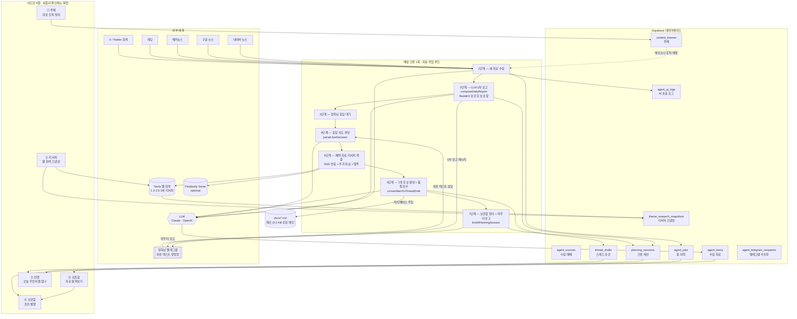
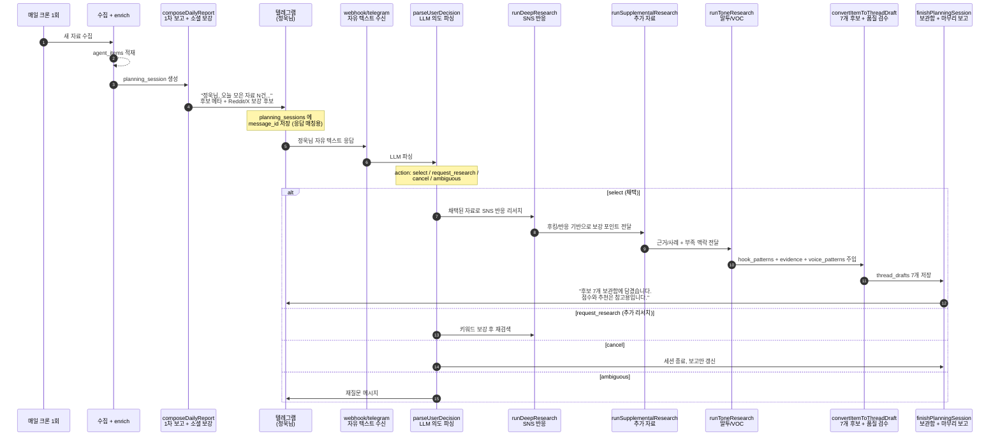
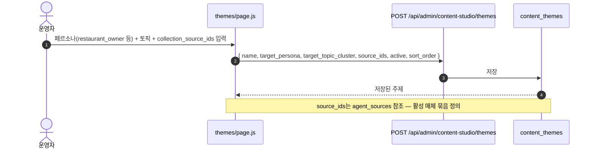
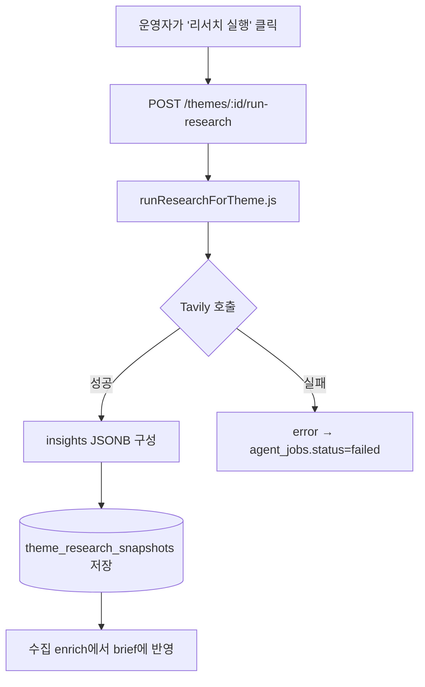
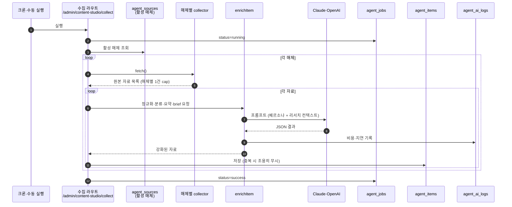
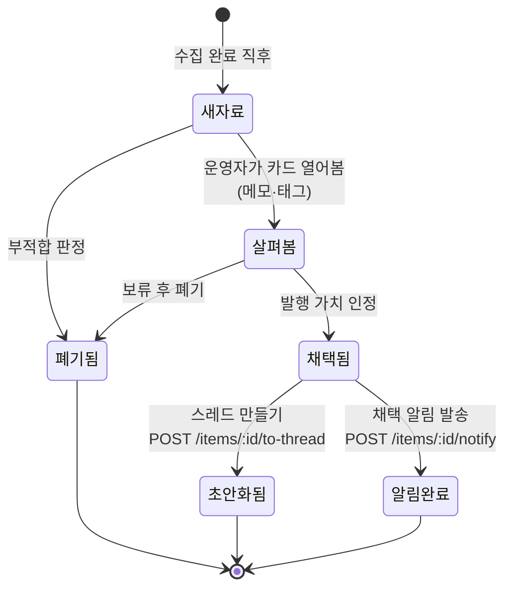
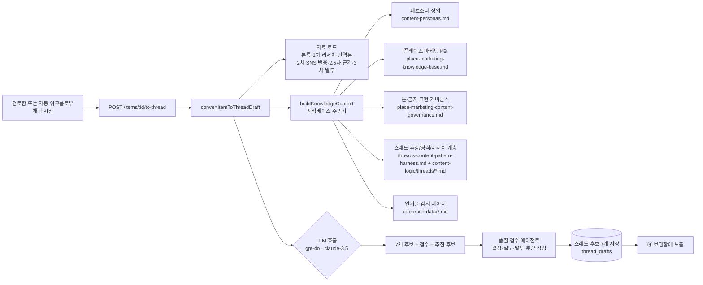
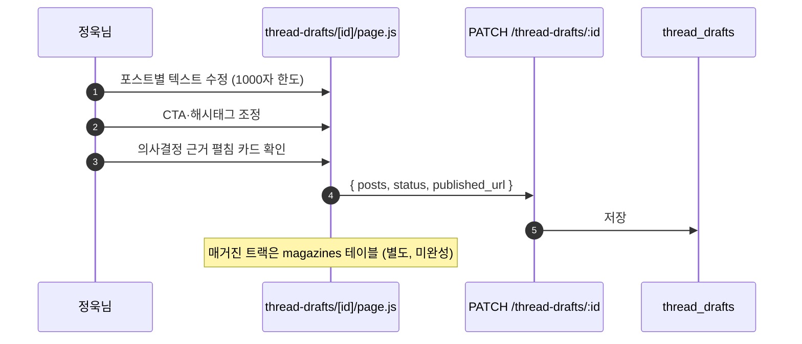
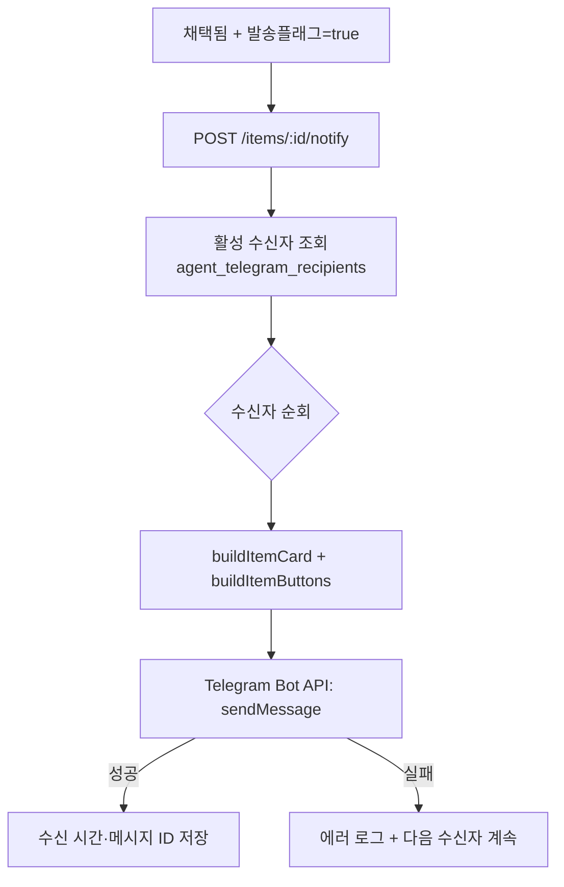

# 콘텐츠 스튜디오 파이프라인 명세서

> **작성일**: 2026-05-21 (최초 2026-05-20, 결정 맥락·자동 워크플로우 보강)
> **범위**: `app/admin/content-studio` — 어드민의 콘텐츠 스튜디오 전체 + 매일 돌아가는 자동 워크플로우
> **목표**: 한 사람이 어디를 만지면 다른 어디가 흔들리는지, 그리고 막혔을 때 어디부터 봐야 하는지를 한 문서에서 다 보이게 한다.

## 📖 이 문서를 읽는 법

콘텐츠 스튜디오는 두 층으로 돌아갑니다.

- **사람 층** — 어드민의 5개 탭. 정욱님이 눈으로 확인하고 손으로 만지는 자리.
- **자동 층** — 매일 한 번 돌아가는 크론 워크플로우. 새 자료 수집 → 1차 자연어 보고 → 정욱님 텔레그램 응답 → 깊이 리서치 → 스레드 초안 생성 → 보관함 정리 + 마무리 보고. **어드민 5탭은 이 자동 흐름의 결과물을 확인·수정하는 인터페이스 역할**.

이 문서는 두 층을 한꺼번에 보여주는 설계 도면입니다.

- **0번 섹션** — 두 층의 한 장 요약 그림. 큰 그림이 안 잡힐 때 여기로 돌아오세요.
- **1번 섹션** — 어드민 5탭의 한 줄 책임.
- **2번 섹션** — **주요 결정 지점**. 지금 이 구조가 왜 이 모양인지, 정욱님이 어떤 판단을 거쳐 여기까지 왔는지.
- **3번 섹션** — 매일 도는 자동 워크플로우 상세. 가장 중요한 흐름.
- **4번 섹션** — 각 단계가 내부적으로 어떻게 움직이는지.
- **5번 섹션** — "내가 이걸 바꾸면 어디가 영향받을까?" 표.
- **6번 섹션** — 외부 의존성. "오늘 갑자기 안 되네?" 싶을 때 어디부터 의심할지.
- **7번 섹션** — 알려진 약점.
- **8번 섹션** — 무언가를 바꾸기 전에 돌리는 점검 목록.

---

## 0. 한눈에 보는 파이프라인



### 🧭 그림을 읽는 법

세 덩어리로 보면 쉽습니다.

- **왼쪽 — 외부 세계**: 시스템이 빌려 쓰는 외부 서비스. 매체에서 글을 끌어오고, AI에게 정리를 시키고, 텔레그램으로 정욱님과 대화합니다. 여기 중 하나가 끊기면 그 구간만 멈춥니다.
- **가운데 위 — 매일 도는 자동 루프**: 7단계. 사람 손이 닿는 곳은 3단계 응답 대기뿐. 나머지는 다 LLM이 처리.
- **가운데 아래 — 어드민 5탭**: 자동 루프의 결과를 정욱님이 눈으로 확인·수정하는 자리.
- **오른쪽 — 데이터베이스**: 모든 결과가 영구 저장되는 곳. 새로고침해도 사라지지 않는 이유.

---

## 1. 5개 탭 각자의 역할 (한 줄 요약)

| #  | 탭        | 어드민 경로                            | 한 줄 책임                                | 결과가 쌓이는 테이블             |
|----|-----------|----------------------------------------|-------------------------------------------|----------------------------------|
| ①  | 주제      | `/admin/content-studio/themes`         | 어떤 대상에게 어떤 주제를 다룰지 정의       | `content_themes`                 |
| ②  | 리서치    | `/admin/content-studio/research`       | 주제별로 웹에서 최신 정보 한 번 훑기       | `theme_research_snapshots`       |
| ③  | 검토함    | `/admin/content-studio/` (기본)        | 모인 자료를 살펴보고 채택/폐기 판정         | `agent_items` (상태 필드)        |
| ④  | 보관함    | `/admin/content-studio/published`      | 채택 자료의 스레드 초안 편집·발행           | `thread_drafts`, `magazines`     |
| ⑤  | 진행      | `/admin/content-studio/activity`       | 자동 작업이 잘 돌고 있는지 살펴보기          | `agent_jobs`, `planning_sessions`|

### 💡 5개로 나눈 이유

기존엔 "텔레그램, 잡 로그, AI 로그, 소스, 승인됨" 같은 내부 용어 탭들이 그대로 노출돼 있었습니다. **2026-04, 정욱님 정신모델 기반으로 리팩터** — 운영자가 머릿속에 그리는 흐름(주제 → 살펴봄 → 채택 → 보관함)을 그대로 탭으로 만들고, 시스템 내부 용어(잡/큐/로그)는 ⑤ 진행 탭 한 곳으로 몰았습니다. 카피도 같이 정리:
- "수집됨" → **새 자료**
- "텔레그램 보내기" → **채택 알림 보내기**
- "승인/반려" → **채택/폐기**
- "via telegram" → **외부 채택**

---

## 2. 주요 결정 지점 — 지금 이 모양이 된 이유

이 섹션이 다른 섹션과 다른 점: "무엇을 한다"가 아니라 **"왜 그렇게 만들었나"**를 적습니다. 시스템을 바꾸기 전에 이 결정의 전제가 여전히 유효한지부터 확인하세요.

### 2.1 자동 워크플로우는 "매일 1회 = 세션 1개"

**결정**: 매일 크론 한 번이 곧 `planning_sessions` 한 행. 그 세션 안에 수집·1차 보고·정욱님 응답·깊이 리서치·초안 생성·마무리 보고가 모두 묶입니다.

**왜 그렇게 했나**:
- 정욱님이 운영하는 실제 패턴이 "하루 한 번, 자료 확인하고 결정 내림"이라서. 시간 단위 알림을 받으면 의사결정 피로가 누적됨.
- 세션 단위로 묶으면 "오늘 결정 결과"가 한 줄로 보이고, 다음 날 같은 흐름이 다시 시작됨 → 운영자가 머릿속에 흐름을 그리기 쉬움.

**커밋 근거**: `4c2bbe8 채정욱 로직 1단계 구현`, `943865d Batch 2/3 자동 워크플로우`.

### 2.2 1차 보고는 자연어, 응답도 자유 텍스트

**결정**: 1차 보고 메시지는 "정욱님, 오늘 모은 자료 N건 중 이런 흐름이 보입니다..." 톤의 자연어. 응답도 버튼 UI가 아니라 자유 텍스트.

**왜 그렇게 했나**:
- 버튼 UI는 결정을 강제로 단순화시킴. "1번 채택, 3번 폐기, 2번은 좀 더 깊이 봐줘" 같은 복합 의사결정이 한 번에 표현 가능해야 함.
- 자유 텍스트 → LLM이 `select / request_research / cancel / ambiguous` 4개 행동으로 파싱 (`parseUserDecision.js`). 사용자 표현의 자연스러움을 시스템이 흡수.

**커밋 근거**: `943865d` ("자유 텍스트 답변을 LLM으로 파싱").

### 2.3 리서치 계층은 채택된 자료에만

**결정**: 2차 SNS 반응 리서치(`runDeepResearch.js`), 2.5차 추가 자료 리서치(`runSupplementalResearch.js`), 3차 말투 리서치(`runToneResearch.js`)는 모든 자료가 아니라 **정욱님이 채택한 자료에만** 돌림.

**왜 그렇게 했나**:
- 모든 자료에 깊이 리서치를 돌리면 비용이 매일 N배 늘어남(자료 건수만큼).
- 채택 후에 돌리면 정확히 발행될 자료에만 깊이가 들어감 → 비용 대비 효과 최적.
- 2차 결과(`hook_patterns`, `audience_reactions`, `adapted_angles`), 2.5차 결과(`evidence_points`, `content_additions`, `missing_context`), 3차 결과(`voice_patterns`, `phrases_to_borrow`, `phrases_to_avoid`)가 초안 생성기에 추가 맥락으로 주입됨.
- `PERPLEXITY_API_KEY`가 있으면 2.5차 보강에서 Perplexity Sonar를 추가로 사용하고, 없어도 Tavily 결과만으로 계속 진행함.

**커밋 근거**: `943865d` (`runDeepResearch` 도입 + `convertItemToThreadDraft`의 `extraContext` 옵션).

### 2.4 의사결정 근거를 어드민에서 모두 공개

**결정**: 스레드 초안에 4개 메타 컬럼을 함께 저장 — `selection_reason`(왜 골랐나), `rejected_candidates`(뭘 버렸나), `governance_applied`(어떤 KB 규칙을 적용했나), `research_context_used`(어떤 리서치를 참고했나).

**왜 그렇게 했나**:
- AI가 자동으로 만든 초안을 사람이 신뢰하려면 "왜 이걸 골랐는지" 즉시 보여야 함. 블랙박스는 운영자가 시스템을 못 믿게 만듦.
- 어드민의 스레드 편집 페이지에 "의사결정 근거" 펼침 카드로 한 곳에 노출. 클릭 한 번에 1차 리서치 인사이트 + 2차 깊이 리서치 패턴 + 폐기 후보 + 거버넌스 적용 내역 모두 확인 가능.

**커밋 근거**: `9e54b36 Batch 1` (DB 컬럼 추가), `943865d Batch 3` (UI 노출).

### 2.5 페르소나는 SSOT로 박혀 있다

**결정**: 페르소나·토픽 클러스터 정의는 `lib/contentTaxonomy.js`에 단일 진실원천(SSOT)으로 박힘. `VALID_PERSONAS`, `CLUSTERS_BY_PERSONA`, `PLACE_RELATED_CLUSTERS` 셋. LLM 프롬프트도, KB 로더도 모두 여기서 읽어 감.

**왜 그렇게 했나**:
- 페르소나 이름·클러스터가 여러 파일에 흩어지면 "음식점인가 요식업인가" 같은 라벨 불일치가 결과물에 드러남.
- SSOT 하나만 고치면 시스템 전체가 일관되게 따라옴.
- 현재 페르소나 v1: **요식업 사장님 / 병의원 원장님**. 둘 다 플레이스 마케팅 핵심 고객.

**커밋 근거**: `9e54b36` (`lib/contentTaxonomy.js` SSOT 신설 + `docs/content-personas.md` v1).

### 2.6 플레이스 토픽은 KB 자동 주입

**결정**: 주제의 `target_topic_cluster`가 플레이스 관련(`place_visibility`, `review_trust`, `local_acquisition`, `local_retention`)이면, 플레이스 마케팅 KB + 거버넌스가 LLM 프롬프트에 **자동으로** 주입됨.

**왜 그렇게 했나**:
- 운영자가 매번 "이 자료는 플레이스 주제니까 KB 넣어줘"라고 챙길 수 없음. 시스템이 토픽 보고 알아서 챙기는 게 맞음.
- 플레이스가 아닌 토픽엔 다른 KB가 와야 하므로, 토픽 → KB 매핑이 코드에 명시됨 (`lib/knowledge/loader.js`).

**커밋 근거**: `eeac8bd` (`enrichItem`에 `themeHint` 옵션 + 플레이스 KB 자동 주입).

### 2.7 검토함은 "투명한 브리프 + 인사이트 펼침"

**결정**: 검토함 카드를 클릭하면 "콘텐츠 기획 브리프"(추천 제목·핵심 앵글·독자 문제·실용 takeaway·실행 단계·리드마그넷 후보)와 "참고한 리서치 인사이트"가 같이 펼쳐짐.

**왜 그렇게 했나**:
- 30초 안에 채택/폐기를 결정하려면 카드 위에서 "이 자료를 어떻게 글로 풀까"가 즉시 보여야 함.
- AI가 만든 brief가 리서치의 어떤 페인포인트·후킹 패턴을 반영했는지 같이 보여야 신뢰가 생김.

**커밋 근거**: `3ce02bc` (브리프 펼침 + 리서치 인사이트 같이 노출).

### 2.8 매체별 1건 cap + 사전 중복 체크

**결정**: 한 매체에서 한 번에 1건만 가져옴. 그리고 이미 본 자료는 사전 중복 체크로 미리 걸러냄.

**왜 그렇게 했나**:
- 매체별 cap 없으면 정욱님이 검토할 카드가 폭주 → 결정 피로.
- 사전 중복 체크 없으면 "오늘은 0건"이 자주 발생 (다 본 자료라서) → 빠른 검증 모드 무의미해짐.

**커밋 근거**: `3f97186` (매체별 1건 cap), `11c88ff` (사전 중복 체크 + fresh-finding).

### 2.9 텔레그램은 카드 단위 발송

**결정**: 텔레그램은 "오늘 자료 N건 다 모은 일일 요약 한 줄" 대신 **카드 한 개씩 발송**.

**왜 그렇게 했나**:
- 일일 요약은 가독성은 좋지만 운영자가 "어떤 자료를 채택할지" 결정할 정보가 부족.
- 카드 단위로 보내면 각 카드에 brief·인사이트가 다 들어가 있어 즉시 결정 가능.

**커밋 근거**: `3f97186` ("매체별 1건 cap + 콘텐츠 브리프 + 카드 단위 발송").

---

## 3. 매일 도는 자동 워크플로우 (가장 중요한 흐름)



### 7단계 한 줄씩

1. **수집** — 활성 매체에서 새 자료 긁어옴. 매체별 1건 cap + 사전 중복 체크. `agent_items` 적재.
2. **1차 자연어 보고** — `composeDailyReport.js`가 그날 모은 자료를 "정욱님, …" 톤 자연어로 요약 + 추천. Reddit/X 보강 후보를 각각 1개씩 추가 시도. `planning_sessions` 행 생성.
3. **응답 대기** — 텔레그램에서 정욱님 자유 텍스트 응답을 기다림. message_id로 세션 매칭.
4. **응답 의도 파싱** — `parseUserDecision.js`가 LLM으로 응답을 4개 행동으로 분류 (select / request_research / cancel / ambiguous).
5. **리서치 계층** — 채택된 자료에만 `runDeepResearch.js`가 SNS 반응을, `runSupplementalResearch.js`가 추가 근거를, `runToneResearch.js`가 실제 말투/VOC를 추출.
6. **스레드 후보 생성** — `convertItemToThreadDraft.js`가 brief + 리서치 계층 + KB(페르소나·플레이스 마케팅·거버넌스·후킹 패턴·인기글 감사)를 모두 LLM 프롬프트에 넣어 7개 후보를 생성하고 품질 검수 에이전트를 통과시킴. `thread_drafts` 7개 행 생성.
7. **보관함 정리 + 마무리 보고** — `finishPlanningSession.js`가 폐기 후보 + 거버넌스 적용 메타 + 리서치 사용 내역을 메타 컬럼에 채우고, 텔레그램으로 "후보 7개 담겼습니다. 점수는 참고용입니다" 마무리 보고.

### 막혔을 때 가장 자주 보는 패턴

- **응답 대기에서 멈춤** → 정욱님이 텔레그램에 답을 안 했거나, 웹훅이 끊김. ⑤ 진행 탭의 "정욱님 응답 대기 중" 박스 확인.
- **리서치 계층만 실패** → Tavily 한도 초과(무료 1000회/월) 또는 Perplexity 키 오류. 1차 보고는 떴는데 마무리 보고가 안 오면 의심.
- **초안 생성 실패** → LLM 키 또는 KB 파일 손상. `agent_ai_logs`에 에러 메시지 남음.

---

## 4. 단계별 세부 흐름

### 4.1 ① 주제 정의 (Themes)

**무엇을 하는 곳인가**: "누구에게(페르소나) 어떤 이야기(토픽)를 들려줄지"를 못 박는 자리. 자동 워크플로우의 수집 단계가 이 주제를 보고 자료를 분류하고, 초안 생성기가 이 주제의 페르소나로 톤을 잡습니다. 주제가 비어 있으면 자동 워크플로우 전체가 "누구한테 쓰는 글인지 모르는 채로" 굴러가서 결과가 어색해집니다.



**영향 관계**
- **페르소나를 바꾸면** → 그 다음에 만들어지는 모든 콘텐츠의 말투·관점·예시가 통째로 바뀝니다. `restaurant_owner`를 `clinic_owner`로 바꾸면 "사장님" 대신 "원장님"이 됩니다.
- **`collection_source_ids`를 조정하면** → 다음 수집이 가져올 매체 묶음이 즉시 바뀝니다.
- **`active=false`로 끄면** → 리서치도 수집도 그 주제는 건너뜁니다. 임시 보관용으로 유용.

**막혔을 때**: 주제 저장이 안 되면 거의 항상 DB 권한(`SUPABASE_SERVICE_ROLE_KEY`) 또는 `agent_sources`에 없는 source_id 참조.

---

### 4.2 ② 자동 리서치 (Research)

**무엇을 하는 곳인가**: 주제별로 "이 주제에 대해 지금 세상에서 무슨 일이 있나"를 한 번 훑어오는 자리. Tavily 웹 검색이 대신 검색해서 요약본을 가져옵니다. 이 결과(스냅샷)는 자동 워크플로우 1단계 수집의 enrich 과정에서 `research_context`로 brief에 반영됩니다.



**영향 관계**
- 같은 주제로 여러 번 돌리면 스냅샷이 쌓입니다. enrich는 **항상 최신 스냅샷**을 참조하므로 옛 스냅샷이 남아도 결과에 영향 없음.
- Tavily 키 누락 시엔 리서치만 실패하고 수집·검토는 멀쩡합니다. 단 결과 퀄리티는 한 단계 낮아짐.

---

### 4.3 수집 (Collect) — 자동 워크플로우 1단계

**무엇을 하는 곳인가**: 외부 매체에서 자료를 긁어와 LLM으로 정규화·분류·요약·brief 생성까지 한 번에. 자동 워크플로우의 첫 단계로, 결과는 곧 검토함 카드가 됩니다.



**왜 enrich가 필요한가**
원본 자료는 제목+링크 한 줄짜리 잡음입니다. 30초 안에 채택/폐기를 결정하려면 페르소나·brief·인사이트가 카드에 박혀 있어야 함. 그 가공을 LLM이 자동으로 합니다.

**영향 관계**
- **중복 방지 자동화**: `agent_items` 테이블 UNIQUE 제약 + 사전 중복 체크로 같은 자료가 두 번 박히지 않음.
- **AI 모델 교체 영향**: enrich 모델을 바꾸면 → 그 직후 카드 품질·비용이 즉시 달라집니다. ⑤ 진행 탭의 비용 카드가 즉시 반영.
- **한 매체가 죽어도 다른 매체는 계속 돕니다**: 레딧이 막혀도 네이버 뉴스는 들어옴.

**가장 자주 보는 에러**: Reddit IP 차단으로 0건 반환. 최근 두 커밋(`82e75b1`, `46b00b2`)에서 대체 처리(old host 재시도 + RSS 폴백) 넣었지만 여전히 불안정. "Reddit만 0건"이 며칠 이어져도 시스템 문제 아닌 경우가 많음.

---

### 4.4 ③ 검토함 (Review) — 사람 손이 들어가는 유일한 관문

**무엇을 하는 곳인가**: 정욱님이 카드를 보고 채택/폐기를 결정하는 자리. 자동 워크플로우에선 텔레그램으로 같은 일이 일어나고, 검토함은 그 결과를 사후에 확인·수정하는 자리.



**영향 관계**
- **채택 = 자동 알림 큐 진입**: `status='approved'`로 올리면 `send_flag=true`가 같이 박혀, 다음 텔레그램 발송 사이클에서 활성 수신자 전원에게 갑니다.
- **`theme_id` 사후 변경 주의**: 카드의 주제를 다른 페르소나로 바꾸면, 다음 초안 생성이 다른 KB를 가져옵니다. 의도한 게 아니면 카드 폐기하고 다시 수집이 안전.

---

### 4.5 ④ 스레드 초안 생성 (자동 워크플로우 6단계)

**무엇을 하는 곳인가**: 채택된 한 장의 카드를 → 7개 스레드 후보로 변환. 여기서 KB와 리서치 계층이 본격적으로 주입됩니다. 페르소나의 말투, 금지 표현, 후킹 패턴, 인기글 구조, 추가 근거, 소셜 VOC가 함께 들어가서 비교 가능한 후보 묶음이 만들어집니다.



**KB 5종이 왜 다 필요한가**
- **`content-personas.md`** — "누가 누구에게 말하는가". 빠지면 톤이 평범해짐.
- **`place-marketing-knowledge-base.md`** — 플레이스 마케팅 도메인 지식. 빠지면 일반론으로 흘러 차별점이 없어짐.
- **`place-marketing-content-governance.md`** — "이런 표현은 쓰지 마" 가이드. 빠지면 과장·법적 위험 표현이 들어갈 수 있음.
- **`threads-content-pattern-harness.md` + `content-logic/threads/*.md`** — 후킹, 형식, FOMO, 대화형 설명, 리서치 계층 규칙. 빠지면 첫 줄과 분량 판단이 약해짐.
- **`reference-data/threads-popular-post-audit-*.md`** — 인기글 분해 데이터. "이런 구조가 잘 먹히더라"의 근거.

**가장 깨지기 쉬운 구간인 이유**
- `docs/*.md` 어느 한 파일이 바뀌면 → 그 직후 만드는 모든 스레드 결과가 달라집니다. 코드 수정 없이 결과물이 변함. KB 파일은 "글로벌 설정"처럼 다뤄야 함.
- KB 변경 이력은 git log 외에 따로 남지 않음. "어제는 잘 됐는데 오늘부터 이상해"의 거의 모든 원인은 KB git 변경.

---

### 4.6 ④ 보관함 / 발행

**무엇을 하는 곳인가**: 만들어진 초안을 정욱님이 마지막으로 다듬어 실제 스레드 앱에 올리는 자리. 자동 워크플로우의 마무리 보고에서 "초안 N개 담겼습니다"가 가리키는 곳.



**왜 사람이 마지막에 또 손봐야 하나**
AI 결과는 80점입니다. 페르소나·톤·구조는 KB 덕에 맞지만, "그 운영자가 어제 만난 사장님의 실제 사례"는 KB에 없음. 그 한 줄을 사람이 끼워넣어야 95점이 됨.

**영향 관계**
- `status='published'` + `published_url` 기록 → ⑤ 진행 탭에서 "이번 주 스레드 초안" 통계에 즉시 집계.
- 매거진 트랙은 UI만 있고 자동 변환은 `convertItemToDraft.js`로 부분 구현 (커밋 `fe43c02`). 발행 자동화는 미완성.

---

### 4.7 텔레그램 발송 (보조 채널)

**무엇을 하는 곳인가**: 자동 워크플로우의 1차 보고·마무리 보고와는 별개로, 검토함에서 "이 카드 좋다" 싶을 때 팀 텔레그램에 카드 형태로 즉시 공유하는 보조 흐름.



**영향 관계**
- **`TELEGRAM_BOT_TOKEN` 누락** → /notify 라우트만 즉시 500. 다른 모든 단계는 멀쩡.
- **한 수신자 실패가 다른 수신자를 막지 않음**: A에게 실패해도 B·C는 정상 발송.
- **수신자 비활성화 즉시 반영**: `active=false`로 끄면 다음 발송부터 제외.

---

## 5. 의존성 표 — "X 바꾸면 어디가 영향?"

위험도: **高 = 결과물 품질이 통째로 바뀜**, **中 = 비용·속도가 바뀜**, **低 = 특정 기능만 막힘**.

| 변경 대상                                    | 영향 받는 단계                                   | 위험도 |
|----------------------------------------------|--------------------------------------------------|--------|
| `content_themes.target_persona`              | 수집 enrich, 초안 생성기 KB 맥락                  | 高    |
| `agent_sources.active`                       | 다음 수집의 매체 집합                            | 中    |
| `docs/content-personas.md`                   | 모든 신규 초안의 톤·페르소나                     | 高    |
| `docs/place-marketing-knowledge-base.md`     | 플레이스 토픽 초안 맥락                          | 高    |
| `docs/threads-content-pattern-harness.md` + `docs/content-logic/threads/*.md` | 모든 스레드 후킹·형식·분량·대화형 설명·리서치 계층 판단 | 高 |
| `docs/place-marketing-content-governance.md` | 금지 표현·톤 규칙                                | 高    |
| `lib/contentTaxonomy.js` 페르소나 enum       | 시스템 전체 페르소나 라벨 일관성                  | 高    |
| `lib/agent/convertItemToThreadDraft.js` 모델| 스레드 톤·비용·지연                              | 中    |
| `lib/agent/composeDailyReport.js` 톤        | 1차 보고 자연어 스타일                           | 中    |
| `TELEGRAM_BOT_TOKEN`                          | /notify + 자동 워크플로우 1차·마무리 보고         | 中    |
| `TAVILY_API_KEY`                              | ② 리서치 + 자동 워크플로우 5단계 깊이 리서치     | 中    |
| `agent_telegram_recipients.active`           | /notify 발송 대상 (자동 워크플로우와 별개)        | 低    |
| `agent_items.status` 수동 변경                | 검토함 필터, 발송 큐, 초안 변환                  | 中    |
| 크론 스케줄 변경                              | 자동 워크플로우 실행 주기 전체                    | 中    |

### 이 표를 어떻게 활용하는가
- **高 위험 변경 전엔** 샘플 자료 1건으로 초안 회귀 시험 먼저 (8번 섹션).
- **中은 비용·지연 트렌드 확인 후 적용** (⑤ 진행 탭 비용 카드).
- **低는 그냥 바꿔도 됩니다.** 영향 좁고 즉시 복구 가능.

---

## 6. 외부 의존성 — 갑자기 안 될 때 어디부터 의심?

| 종류        | 항목                              | 환경변수                  | 끊겼을 때 영향                      |
|-------------|-----------------------------------|---------------------------|-------------------------------------|
| LLM         | OpenAI / Anthropic                | `OPENAI_API_KEY` · `ANTHROPIC_API_KEY` | enrich, 초안 변환, 1차 보고, 의도 파싱 전면 중단 |
| 웹 검색     | Tavily                            | `TAVILY_API_KEY`          | ② 리서치 + 자동 워크플로우 2차 깊이 리서치만 실패 |
| 웹 근거 보강 | Perplexity Sonar                  | `PERPLEXITY_API_KEY`      | 2.5차 보강 일부만 생략, 기본 Tavily 리서치는 계속 |
| 매체        | 네이버 / 구글 / 해커뉴스 / 레딧    | 없음 (공개 RSS/HTML)      | 해당 매체만 0건 반환                 |
| 메신저      | Telegram Bot                      | `TELEGRAM_BOT_TOKEN`      | /notify + 1차·마무리 보고 실패       |
| DB          | Supabase                          | `NEXT_PUBLIC_SUPABASE_URL`, `SUPABASE_SERVICE_ROLE_KEY` | 전 단계 정지 |

### 문제 해결 순서
1. **모든 게 안 돈다** → Supabase 또는 LLM 키 의심. ⑤ 진행 탭의 최근 잡 에러 메시지부터.
2. **자동 워크플로우 1차 보고는 왔는데 마무리 보고가 안 옴** → 정욱님 응답이 없거나, 리서치 계층에서 Tavily 한도 초과/LLM 오류.
3. **검토함은 차는데 텔레그램만 안 옴** → `TELEGRAM_BOT_TOKEN` 또는 수신자가 봇을 차단.
4. **한 매체만 0건** → 그 매체 자체 문제. 시간 두고 자동 복구되는 경우가 대부분.

---

## 7. 알려진 약점 (모르고 만지면 데이는 곳)

1. **매거진 자동 발행 미완성** — `magazines` 테이블·라우트 존재, `convertItemToDraft.js`로 자동 변환은 일부 구현(`fe43c02`). 발행 자동화는 아직 없음. UI에서 매거진 카드 클릭해도 동작 안 함.
2. **KB 파일 변경 추적 부재** — `docs/*.md` 변경 이력은 git log뿐. "어제까진 잘 됐는데 오늘부터 이상해"의 거의 모든 원인. KB 수정 커밋엔 항상 "왜 바꿨는지" 메시지 남기는 게 안전.
3. **주제 변경 시 과거 자료 재처리 없음** — 검토함에서 `theme_id`를 사후 변경해도, 이미 만들어진 초안은 옛 맥락 그대로. 다시 생성해야 반영됨.
4. **자동 워크플로우 모니터링 알림 없음** — ⑤ 진행 탭에서 보이긴 하지만 푸시 알림 없음. 24시간 무수집이어도 조용히 무시됨. 매일 ⑤ 탭을 보는 루틴이 사실상의 알림.
5. **Reddit 차단 빈도** — 최근 두 커밋에서 대체 처리 추가했으나 여전히 불안정. "Reddit만 0건"이 며칠 이어져도 시스템 문제 아닌 경우가 많음.
6. **응답 의도 파싱 ambiguous 처리** — `parseUserDecision.js`가 ambiguous로 판정하면 봇이 재질문하지만, 무한 루프 방지 장치 없음. 정욱님 응답이 계속 모호하면 사람이 직접 끊어야 함.

---

## 8. 변경 시 점검 목록 (무언가 바꾸기 전에)

```
[ ] 페르소나 또는 KB 수정 → 샘플 자료 1건으로 to-thread 회귀 시험 (이전 결과 vs 새 결과 비교)
[ ] LLM 모델 교체 → agent_ai_logs로 비용·지연 비교 후 적용
[ ] agent_sources 추가 → enrich 프롬프트가 새 source_type 처리 가능한지 확인
[ ] 텔레그램 수신자 추가 → /telegram-recipients에서 chat_id 검증 후 active=true
[ ] thread_drafts 스키마 변경 → published/page.js + thread-drafts/[id]/page.js 동시 수정
[ ] 크론 스케줄 변경 → 자동 워크플로우 1회/일 전제가 깨지는지 확인
[ ] lib/contentTaxonomy.js 페르소나 enum 추가 → docs/content-personas.md에 프로필 동시 추가
```

### KB 수정 후 회귀 시험 절차
1. 검토함에서 "다양한 페르소나가 섞인" 카드 3개 골라두기 (요식업·병의원·일반 각 1).
2. KB 수정 전 — 각 카드를 한 번씩 to-thread 돌려 결과 보관.
3. KB 수정 후 — 같은 3개 카드 다시 to-thread.
4. 두 결과 나란히 비교 → 의도한 변화만 일어났는지 확인.

이 절차 없이 KB만 바꾸면 "요식업 카드 결과는 좋아졌는데 병의원 카드 톤이 어색해진 걸 며칠 모르고 지나가는" 사고가 납니다.

---

## 📎 참고 — 다이어그램 PNG

이 문서의 모든 다이어그램은 `docs/diagrams/` 폴더에 PNG로도 저장:
- `01-overview.png` — 0번 섹션의 전체 파이프라인 (자동 루프 + 5탭 통합)
- `02-review-state.png` — 검토함 상태 머신
- `03-thread-conversion.png` — 스레드 초안 생성 흐름
- `04-collect-sequence.png` — 수집 순서
- `05-auto-workflow.png` — 매일 도는 자동 워크플로우 7단계

VSCode에서 `.md` 파일을 열면 Mermaid도 그대로 렌더링됩니다 (Markdown Preview Mermaid Support 확장 필요).

---

*Generated by Claude Code · 2026-05-21 갱신본.*
