# 기브니즈 스레드 콘텐츠 파이프라인 — 리서치부터 발행까지

> 사용자가 "후보 N" 으로 답한 순간부터 Threads 발행까지의 전 단계. 함수·LLM·파일·DB 모두 포함.
> mermaid 다이어그램이 그림으로 렌더링되는 뷰어(GitHub, VSCode + Mermaid extension, Obsidian, Notion)에서 보면 됨.

## 한 장 요약

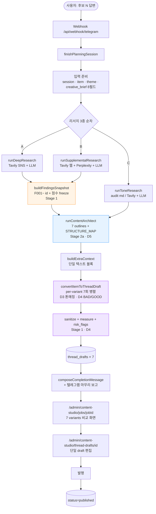

색 범례:
- 주황: Stage 1 (findings freeze + 수치 금지)
- 파랑: Stage 2a (Architect + STRUCTURE_MAP) + D5 (takeaway 슬롯 운반)
- 보라: D3 (variant별 톤 매칭) + D4 (BAD/GOOD + 정량 risk_flag)

---

## 단계 0 — 트리거 (시퀀스)

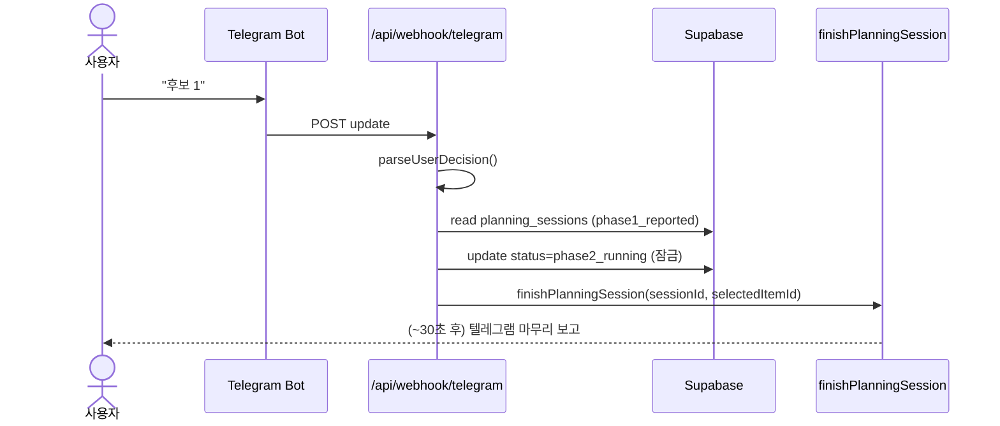

---

## 단계 1 — 입력 준비

`finishPlanningSession.js` 첫 부분.

| 항목 | 출처 |
|---|---|
| `session` | `planning_sessions(id)` — job_id, candidates_summary, telegram_chat_id |
| `item` | `agent_items(selectedItemId)` — classification, normalized, research_context |
| `theme` | `content_themes(item.theme_id)` |
| `creativeBrief` | `session.candidates_summary[selectedItemId].creative_brief` (8필드) |

**creative_brief 의 8필드** (sharpening 결과):

| 필드 | 의미 |
|---|---|
| `topic_title` | 발행 제목 방향 (30자 이내) |
| `reader_problem` | 독자가 겪는 현장 장면 |
| `core_angle` | 날선 주장 1문장 |
| `hook_candidate` | 첫 줄 후보 (30자 이내, 결론 미완성) |
| `evidence_needed` | 받쳐야 할 구체 근거 2~4개 |
| `planning_purpose` ★D1+D2 | `["change"|"resolve"|"improve"]` 1~2개 |
| `reader_takeaway` ★D1+D2 | "행동:" / "관점:" / "기준:" prefix 강제 |
| `proof_anchor_type` ★D1+D2 | `["numbers"|"case"|"workflow"|"comparison"]` 1~2개 |

---

## 단계 2 — 리서치 3종

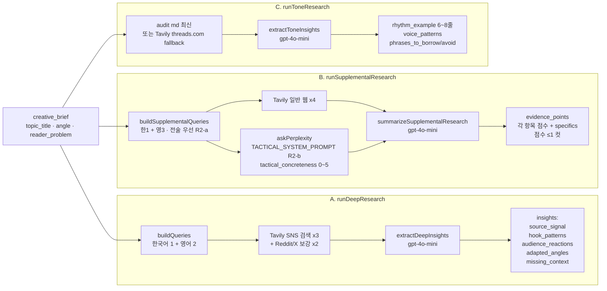

### Perplexity 시스템 프롬프트 핵심 (R2-b)
- **PRIORITIZE**: practitioner first-person ("I ran X with Y prompt and got Z"), exact tool names, measurable outcomes, failure stories with cause
- **EXCLUDE**: corporate blog posts, "X is important" type, predictions, generic best-practices, vendor marketing
- 각 finding 에 `tactical_concreteness` 0~5 점수 + `specifics` 배열 (도구·수치·명령)
- 점수 ≤1 자동 제외, 내림차순 정렬

---

## 단계 3 — Findings Snapshot Freeze ★ Stage 1

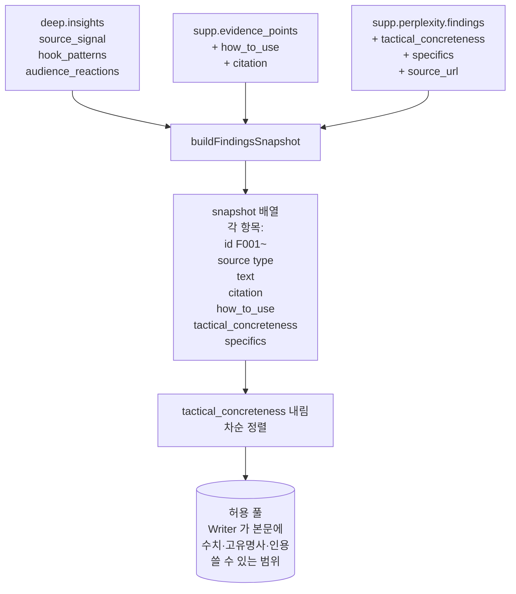

**핵심 원칙**: Writer 가 본문에 수치/고유명사/인용을 쓰려면 이 snapshot 안의 `F###` 가 그 사실을 직접 명시해야 함. 범위 밖은 *학습된 그럴듯한 숫자* 라도 금지.

---

## 단계 4 — Content Architect ★ Stage 2a + D5

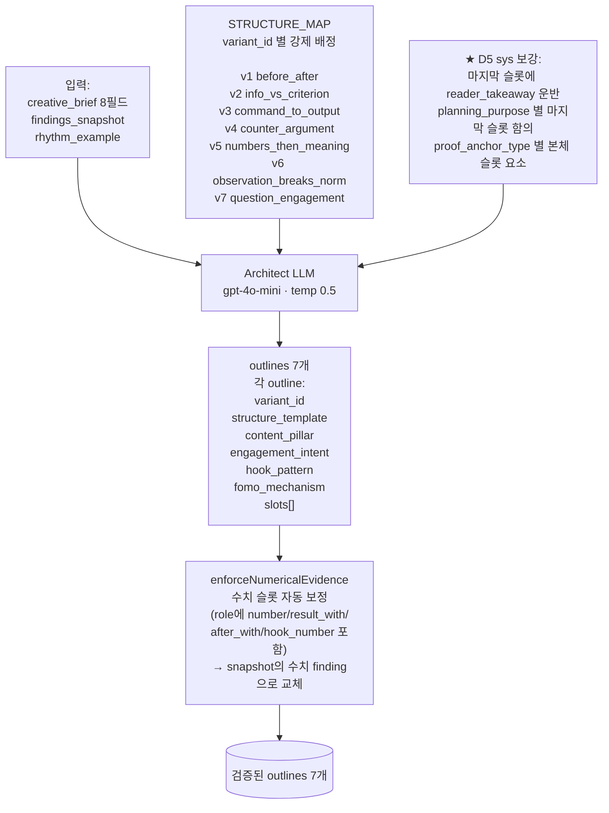

**각 outline 의 slot 명세** (Writer 가 형식·증거를 강제당하는 지점):

| 필드 | 의미 |
|---|---|
| `role` | 슬롯의 역할 (hook_before, criterion_claim, result_with_numbers 등) |
| `intent` | 그 슬롯이 독자에게 무엇을 일으켜야 하는가 |
| `evidence_ids` | snapshot 의 F### 핀 박힘 (자료 인용 제한) |
| `takeaway` | 슬롯이 끝났을 때 독자 머릿속에 남아야 할 것 |
| `max_chars` | 슬롯 본문 최대 글자수 (40~280) |
| `forbidden` | 이 슬롯에서 금지되는 패턴 |

---

## 단계 5 — Extra Context 조립

`buildExtraContext` 가 모든 컨텍스트를 단일 텍스트 블록으로:

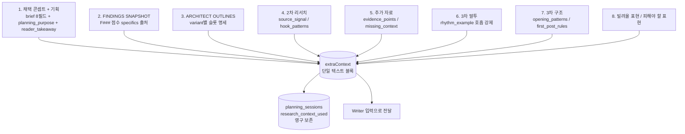

---

## 단계 6 — Writer (per-variant)

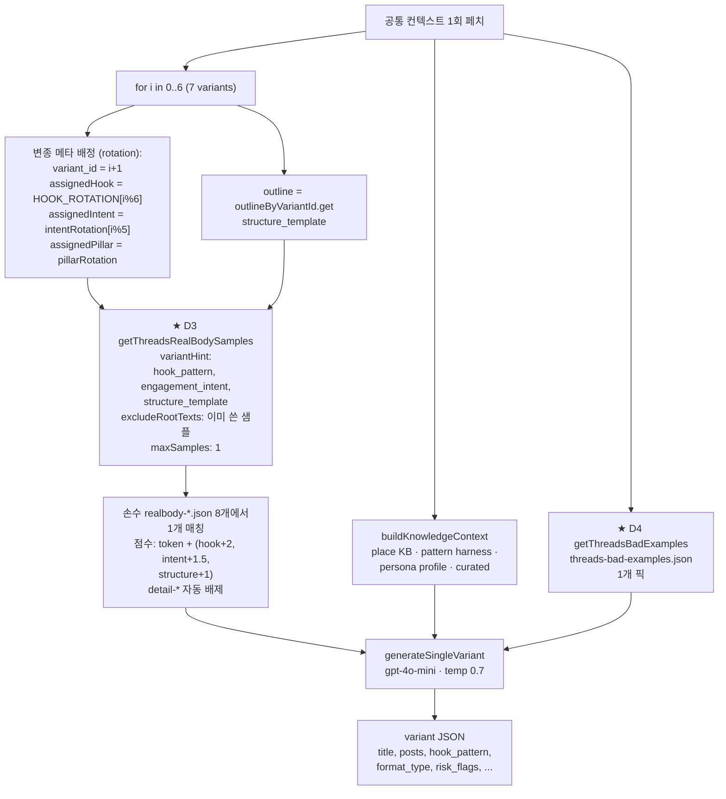

### Writer sys prompt 구조 (위에서 아래로)

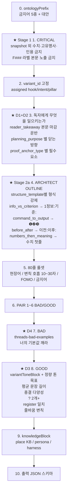

---

## 단계 7 — 후처리 (sanitize · measure · risk_flag · verdict)

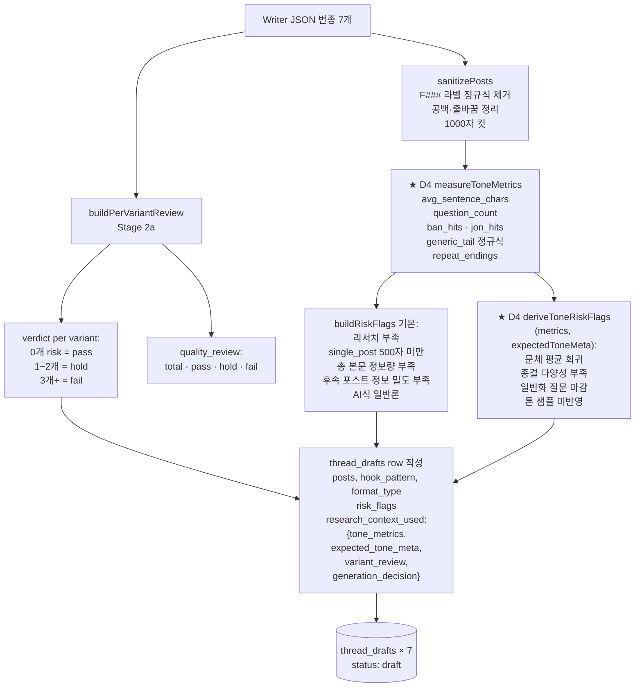

---

## 단계 8 — finishPlanningSession 마무리

각 saved draft 에 research_context_used 를 merge·overwrite:

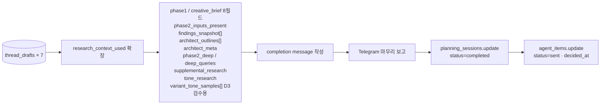

마무리 보고 텔레그램 내용:
- 주제 · 채택 제목 · 원본 URL
- 먼저 잡은 기둥 후보
- 저장된 7 draft 링크 (메타·verdict)
- 2차/추가/3차 리서치 반영 요약
- **허브 URL**: `/admin/content-studio/jobs/[jobId]`
- 대표 단건 URL: `/admin/content-studio/thread-drafts/[draftId]`

---

## 단계 9 — 어드민 검수

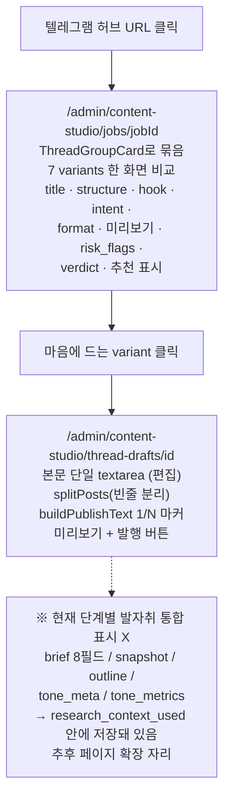

---

## 단계 10 — 발행

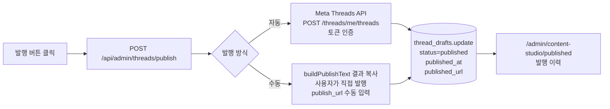

---

## 부록 1 — 데이터 흐름 한 장

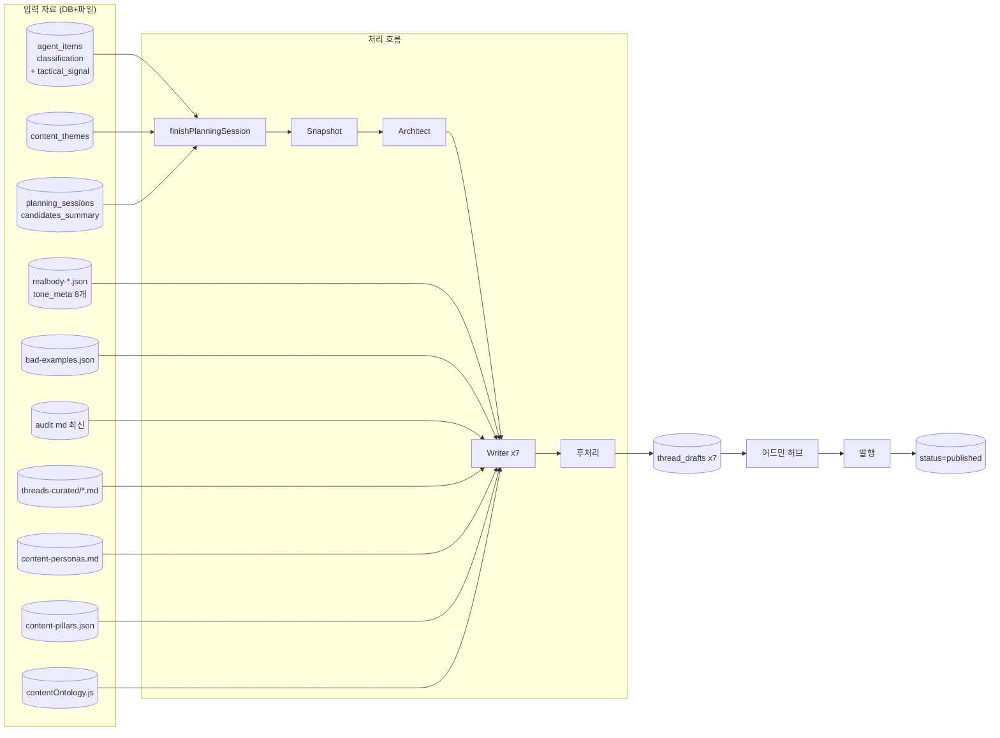

---

## 부록 2 — Phase 2 LLM 호출 집계 (한 사용자 답변당)

| 호출 | 모델 | 횟수 | 단계 |
|---|---|---|---|
| Deep Research insight | gpt-4o-mini | 1 | runDeepResearch |
| Supplemental Perplexity | Sonar API | 1 | askPerplexity |
| Supplemental summary | gpt-4o-mini | 1 | summarizeSupplementalResearch |
| Tone Research | gpt-4o-mini | 1 | extractToneInsights |
| Architect | gpt-4o-mini | 1 | runContentArchitect |
| Writer × 7 | gpt-4o-mini | 7 | generateSingleVariant 병렬 |
| **합계** | — | **11 + 1** | — |

대략 비용 ~$0.03/실행 (Writer 합산 약 $0.02 + 나머지)

---

## 부록 3 — 파일·DB 테이블 매핑

### 파일 (Writer/Architect 참조)

| 파일 | 용도 | 적용 단계 |
|---|---|---|
| `docs/reference-data/threads-realbody-*.json` | 손수 톤 샘플 8개 + tone_meta | ★ D3 |
| `docs/reference-data/threads-bad-examples.json` | BAD 1~2개 (AI 말투 회귀) | ★ D4 |
| `docs/reference-data/threads-popular-post-audit-*.md` | Apify 주차 감사 | runToneResearch |
| `docs/reference-data/threads-curated/*.md` | 큐레이션 KB | Writer knowledgeBlock |
| `docs/reference-data/threads-reference-detail-*.json` | 스크래퍼 임시 (.gitignore) | 톤 매칭에서 자동 배제 |
| `docs/content-personas.md` | persona 프로필 | Writer knowledgeBlock |
| `docs/content-logic/threads/*.md` | pattern harness | Writer knowledgeBlock |
| `config/content-pillars.json` | pillar / intent SSOT | choosePillarStrategy |
| `lib/agent/contentOntology.js` | 금지어 + enum SSOT | ontologyPrefix |
| `lib/agent/runContentArchitect.js` | STRUCTURE_MAP SSOT | runContentArchitect |

### DB 테이블

| 테이블 | 주 내용 |
|---|---|
| `agent_items` | 원문 + classification (R1 tactical_signal 포함) |
| `content_themes` | 주제 매핑 |
| `planning_sessions` | 1차/2차 세션 + candidates_summary (8필드 brief) |
| `thread_drafts` | 7 variants + research_context_used 전체 흔적 |
| `agent_telegram_recipients` | 텔레그램 발송 대상 |
| `agent_ai_logs` | 모든 LLM 호출 자동 로깅 (prompt + response) |

---

## 부록 4 — 적용된 강화 단계 매핑

| 강화 | 위치 | 무엇을 |
|---|---|---|
| **R1** tactical_signal | `lib/llm.js` `computeTacticalSignal` | enrich fit_score 에 ×0.6~1.4 곱셈. 추상 키워드 페널티 / 전술 키워드 가산 |
| **R2-a** 전술 쿼리 | `runDeepResearch.js`, `runSupplementalResearch.js` `buildQueries` | 한국어 1 + 영어 2~3. reddit/twitter actual workflow + ROI numbers |
| **R2-b** Perplexity TACTICAL | `lib/research/perplexityProvider.js` | 시스템 프롬프트 재작성. tactical_concreteness 0~5 + specifics |
| **R2-c** snapshot 점수 | `finishPlanningSession.js` `buildFindingsSnapshot` | 점수 보존 + 정렬 + 컷 |
| **Stage 1** snapshot freeze + hard rule | `finishPlanningSession.js` + `convertItemToThreadDraft.js` | F### id 부여 / Writer sys 에 CRITICAL 수치·고유명사·인용 금지 + sanitize F### 라벨 제거 |
| **Stage 2a** Architect | `lib/agent/runContentArchitect.js` 신설 | STRUCTURE_MAP v1~v7 강제. slot에 evidence_ids 핀 박기. enforceNumericalEvidence |
| **D1+D2** sharpening 8필드 | `composeDailyReport.js` `sharpenCreativeBriefs` | planning_purpose / reader_takeaway / proof_anchor_type 추가 |
| **D3** variant 톤 매칭 | `lib/knowledge/loader.js` `getThreadsRealBodySamples` + per-variant 페치 | tone_meta 라벨링 + variantHint matching + excludeRootTexts 누적 |
| **D4** BAD/GOOD + 정량 risk_flag | `threads-bad-examples.json` 신설 + `measureToneMetrics` + `deriveToneRiskFlags` | sys prompt BAD/GOOD 비교 + 코드 자동 측정 |
| **D5** Architect 기획 운반 | `runContentArchitect.js` sys prompt 보강 | 마지막 슬롯에 reader_takeaway / planning_purpose 별 슬롯 함의 / proof_anchor_type 별 요소 |

---

## 부록 5 — 함수·파일 참조 색인

```
[Phase 2 진입]
  app/api/webhook/telegram/route.js
  lib/agent/finishPlanningSession.js   ← 마스터 오케스트레이터

[리서치]
  lib/agent/runDeepResearch.js
  lib/agent/runSupplementalResearch.js
  lib/agent/runToneResearch.js
  lib/research/searchProvider.js       (Tavily 래퍼)
  lib/research/perplexityProvider.js   (Sonar API)

[기획·구성]
  lib/agent/composeDailyReport.js      (sharpenCreativeBriefs)
  lib/agent/runContentArchitect.js     (STRUCTURE_MAP + outlines)

[작성·후처리]
  lib/agent/convertItemToThreadDraft.js   (Writer per-variant)
  lib/knowledge/loader.js                 (실제 톤·BAD·KB 페치)
  lib/agent/contentOntology.js            (금지어·enum SSOT)
  lib/agent/contentPillarStrategy.js      (pillar/intent rotation)

[발신]
  lib/agent/sendPlanningMessage.js     (텔레그램 전송)

[어드민]
  app/admin/content-studio/jobs/[jobId]/page.js
  app/admin/content-studio/thread-drafts/[id]/page.js
  app/admin/content-studio/sessions/[sessionId]/page.js
  app/admin/content-studio/published/page.js
```
